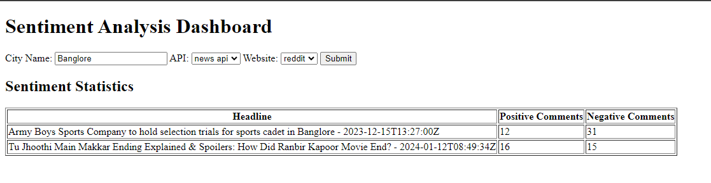
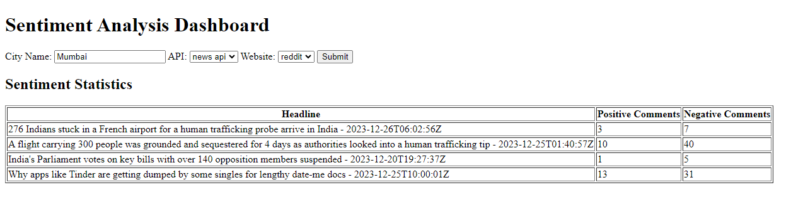

# Approach

## Main goal
The aim is to build a small dashboard that provides insights into the sentiments and discussions happening in a city around a specific topic.

## Task 1
The initial step involves data collection using the 'News API' to acquire trending topics within a city. The API facilitates keyword-based calls, delivering top headlines sorted by popularity. The city name serves as the keyword to fetch the top 5 topics. The primary challenge encountered was identifying a suitable free/open-source API meeting the specified criteria.

## Task 2
For obtaining relevant discussions corresponding to each headline, the Reddit platform and the PRAW library (Python Reddit API Wrapper) are employed. Initially, I attempted to search for discussions within the city's subreddit. However, the results proved inadequate. Subsequently, a broader search was conducted across all subreddits. The retrieved data is confined to 5 discussions and their top 10 comments, determined by scores. This information is stored in a dictionary and returned. The primary challenge in this phase was identifying a suitable data source containing relevant discussions.

## Task 3
For sentiment analysis, I use the pipeline from transformers, defaulting to DistilBERT. I retrieve the data dictionary from the previous task, convert it into a pandas dataframe, and pass the comments through the pipeline. Sentiment labels and scores are stored in a new dataframe and concatenated with the previous dataframe to create the result, which is then returned.

## Task 4
The Flask application facilitates user interaction, where the input city name triggers the retrieval of the top 5 headlines. Subsequently, relevant discussions for each headline are gathered, sentiment analysis is performed, and the resulting dataframe is presented. The data is organized by headline and sentiment label, showcasing the count of positive and negative comments for each headline. Notably, the application selectively displays results only for headlines with available discussions.

---

## Project Structure

|
|__
|  data 
|
|__
|  env
|
|__
   src

- /data: Contains retrieved and processed data for one city as an example.
- /env: Contains the Conda environment .yml file for this project.
- /src: Contains the source code.

---

## Working

1. `src/fetch_headlines.py`: Logic for fetching hot topics given a city name.
2. `src/gather_data.py`: Logic for scraping discussions from Reddit for each topic.
3. `src/sentiment_analysis.py`: Logic for performing sentiment analysis on each comment for each topic.
4. `src/app.py`: Main Flask app that takes user input and displays the analysis results.

- Clone the repository using `git clone`.
- Change directory to the cloned repository `cd <repository-name>`.
- Create Conda enviorment using .yml file `conda env create --name <enviorment-name> -f env_file/enviorment.yml`.
- Activate the Conda enviorment `conda activate <enviorment-name>`
- Run the Flask app `python app.py`.
- Enter the city name, choose the API and data sources, and the analysis results are displayed.

---

## Example usage

